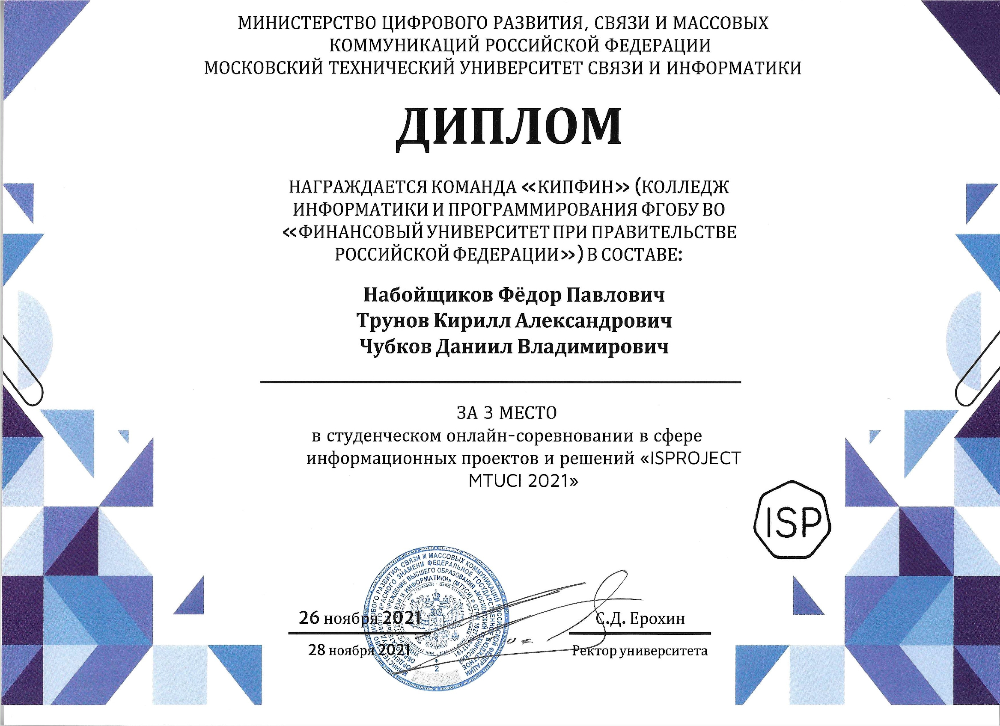

# Онлайн соревнование от МТУСИ
## Описание:
### Данный код проверяет валидность доменов, и выявления DGA
### Изначально планировалось использовать "Древа решений", из-за незватки знаний, я написал алгоритм, который вручную фильтрует домены

## Запуск проекта:
```
python main.py
```
